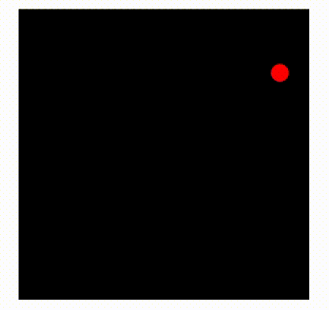

# Canvas


* *File canvas1.js* contains 6 functions, one for each of the shapes. From left to right and top to bottom, the shapes are

  * zigzagging
  * trapezoid
  * diamond
  * spiral
  * star
  * pie chart

> Note: Specifics of the shapes such as width, height, color, number of points, position and font can be customized. 



* Function in *File canvas2.js* draws a box with a bouncing ball in it. The ball moves at a constant speed and bounces off when it hits the box's sides.

To start, create a context on the canvas DOM element to get access to the drawing interface. Replace #canvas with #canvas1 or #canvas2 to select the target element in HTML file. 
```
let cx = document.querySelector("#canvas").getContext("2d")
```
