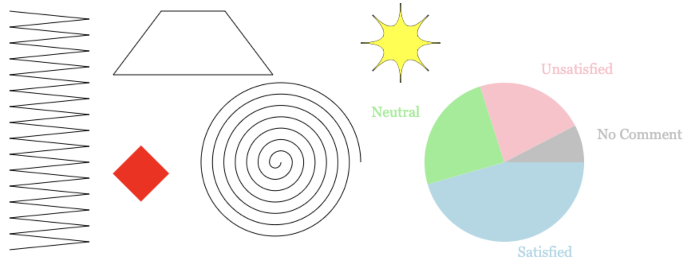

**README.md**


# Canvas


From left to right and top to bottom, 6 shapes were drewn using HTML canvas:

* zigzagging
* trapezoid
* diamond
* spiral
* star
* pie chart

File canvas1.js created 6 functions, one for each of the shapes. To start, create a context on the canvas DOM element to get access to the drawing interface. 
```
let cx = document.querySelector("canvas").getContext("2d")
```
Specifics of the shapes such as width, height, color, number of points, position and font can be customized. 
